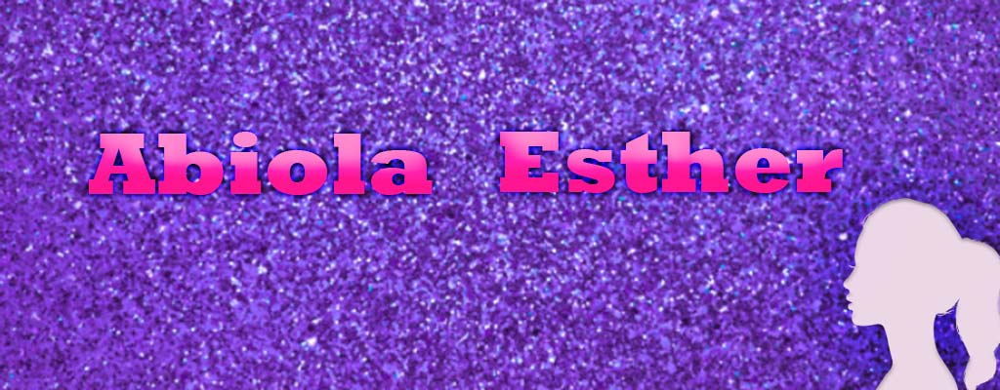

<!--
**Abiola-Farounbi/Abiola-Farounbi** is a ✨ _special_ ✨ repository because its `README.md` (this file) appears on your GitHub profile.

Here are some ideas to get you started:

-->
## Hi !!! 👋
  

 
### I am a Front-end developer and sometimes i write technical articles. I am passionate about devolping and designing user friendly and web accessible applications.
**[MY PORTFOLIO](https://abiolaesther.netlify.app/)**

*ABOUT ME...*

- 👯 I’m looking to collaborate on different open-source projects
- 💬 Ask me about: Javascript ❤️ 
-  👩‍💻 Currently learning: React
- 📫 How to reach me: 
- 🤝 Connect with me on LinkedIn: [LinkedIn](https://www.linkedin.com/in/abiola-farounbi-94ba571a0/)
- ⚡ Fun fact: I love watching and giving reviews on movies 😜
  

 
